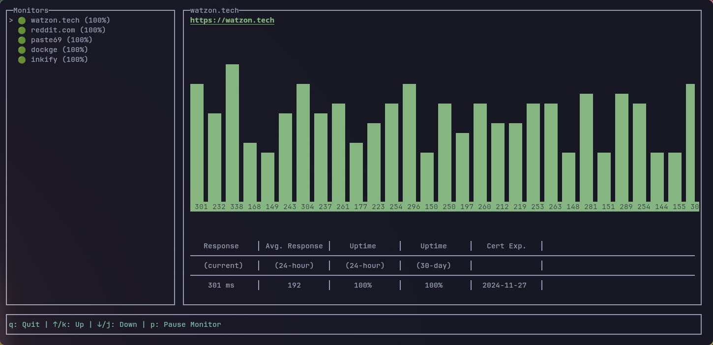

# Go Up

Go Up is a simple TUI based tool to monitor the status of your services.



## ⭐ Features

- Monitoring uptime for HTTP(S) services
- Pretty ok terminal UI
- 60 second monitor interval
- Ping chart with downtime indicator

## 🔧 Installation

### 🐳 Docker

```sh
# Run the daemon
docker run -d -p 1234:1234 --name go-up-daemon ghcr.io/watzon/go-up:latest

# Run the CLI
docker exec -it go-up-daemon go-up
```

### 🧿 Local Install

There are 3 ways to install Go Up locally:

1. `go install github.com/watzon/go-up/cmd/go-up@latest` (preferred)
2. `git clone https://github.com/watzon/go-up.git && cd go-up && go build -o go-up cmd/go-up/main.go && ./go-up`
3. Dowload the [latest release](https://github.com/watzon/go-up/releases/latest) for your OS and run `./go-up`

## 📄 Configuration

Most of the configuration is done via command line flags or environment variables, however you can also provide a config file at `~/.go-up.yaml`.

```yaml
daemon:
  host: localhost
  port: 1234
```

More configuration options will be added in the future.
